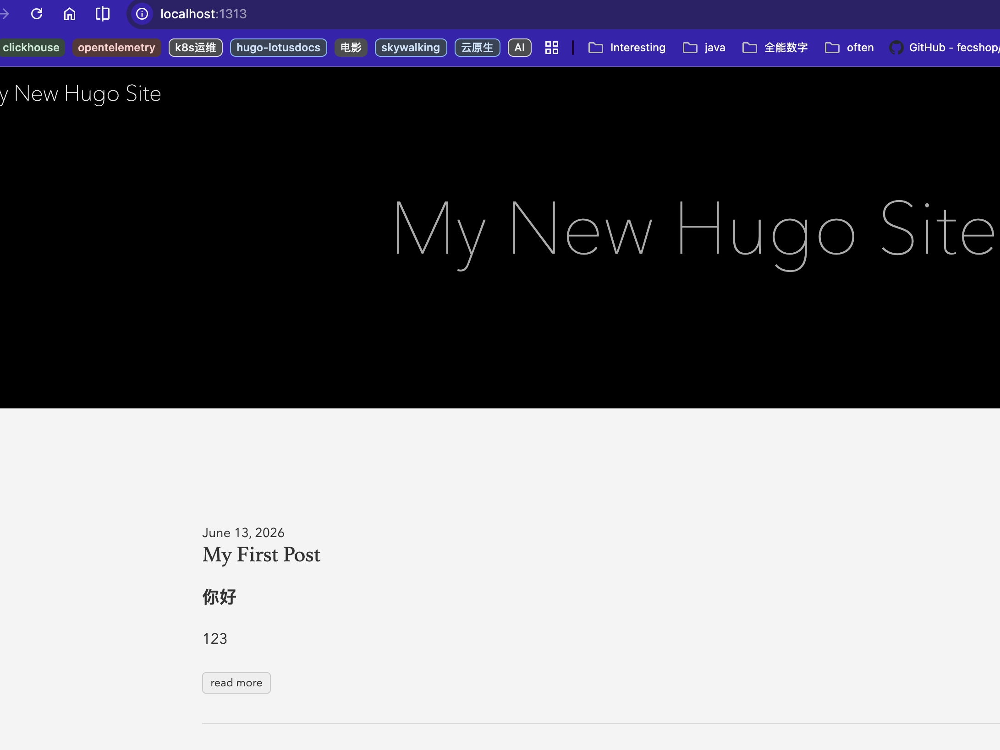
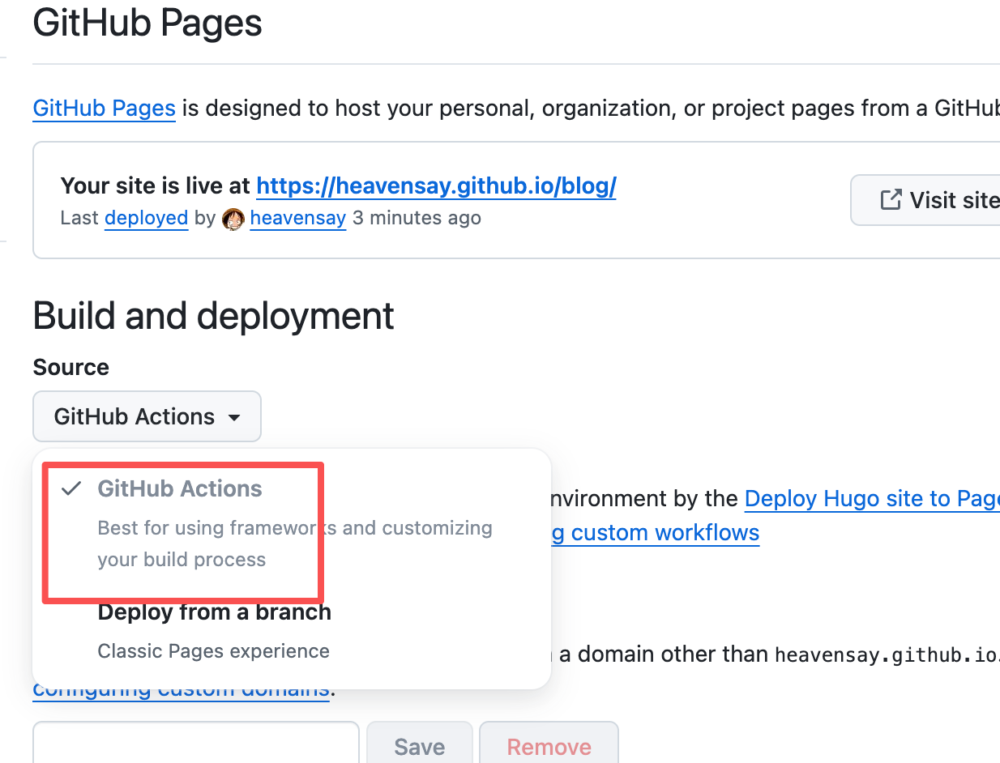
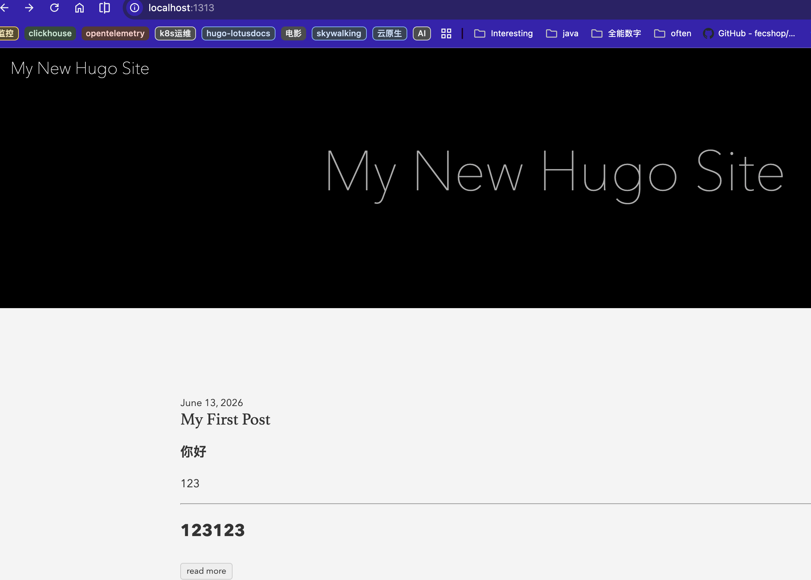
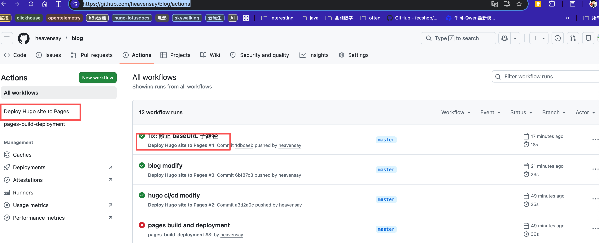
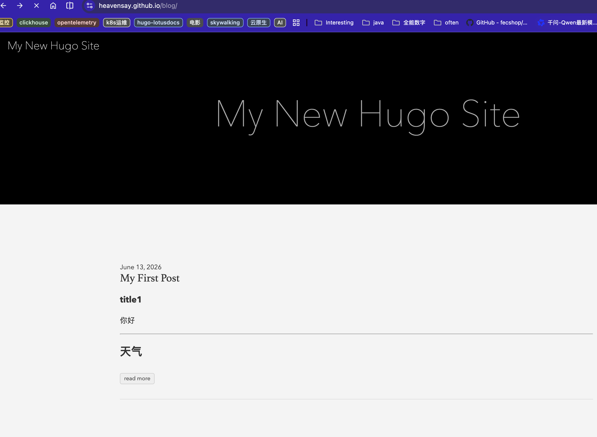

# Note\_hugo
## 介绍12
Hugo是一款强大的用于生成静态网页的程序，擅长于将 Markdown 文档按需要转换成各类主题的静态网页；它由Go语言编写的，在处理速度上非常快；也有人对比过类似一些产品比如 Jekyll / Hugo / Hexo，其编译网页的速度是最快的。

使用Hugo的主要场景包括搭建公司、产品或个人网站，尤其是在结合云服务器的环境下。它的强大性不仅体现在速度上，也涵盖了灵活性和多样性。静态网页生成的成果可以轻松部署于GitHub Page、Gitee Page等平台，同时也能便捷地转换为各种主题形式，满足用户多样化的需求。


核心优势

* **闪电般的构建速度**：号称“构建网站的全球最快框架”，生成中等规模网站通常只需几分之一秒（单页渲染时间不到 1 毫秒）。
* **原生支持 Markdown**：内容采用 Markdown 语法编写，开发者只需专注于写作，Hugo 负责自动排版和渲染。
* **高安全性与低成本**：生成的是纯静态 HTML 和 CSS 文件，无需数据库或后端脚本，抗攻击能力强，且可以免费部署在 GitHub Pages 等平台上。
* **即时实时重载**：在本地开发时，页面会根据代码修改即时刷新（LiveReload），提升开发体验。


工作原理

Hugo 就像一个自动化工厂。它接收包含你网站结构、内容（Markdown）以及模板主题的文件夹，通过内置引擎处理，最终输出一套完整的、可直接上线的 HTML 静态网站。


---
## lotus
Lotus Docs 是一款专为 Hugo 静态网站生成器设计的现代化轻量级文档主题。它主要用于帮助开发者、团队或企业快速构建外观精美、响应迅速且对SEO友好的知识库和文档网站。


---
## docker安装


```bash
services:
  hugo:
    image: hugomods/hugo:latest
    ports:
      - "1313:1313"
    volumes:
      - /usr/local/docker-data/hugo/my-blog-site:/src
    working_dir: /src #关键点：确保容器在挂载的目录下执行命令
    #-D 参数（代表连同草稿一起渲染）
    command: server -p 1313 --bind 0.0.0.0 -D
```


地址：[http://localhost:1313/](http://localhost:1313/)


Github Actions

All versions and variants published using this repository may be used in any combination.


Simple configuration for e.g. .github/workflows/hugo.yml:

```bash
name: Hugo

on: [push]

jobs:
  build:
    runs-on: ubuntu-latest

    steps:
    - uses: actions/checkout@v1

    - name: hugo
      uses: klakegg/actions-hugo@1.0.0
```


---
## 示例
hugo用docker安装，我们在hugo中发布一篇文章，并且展示出来。来看看如何配置


### 初始化站点
```bash
#初始化站点： 在空文件夹下运行以下命令
#这会在你当前的宿主机目录下生成 hugo.toml、content/、themes/ 等初始化文件。
docker compose -f hugo-docker-compose.yaml run --rm hugo new site my-blog-site
```


### 运行hugo server进行本地实时预览
进入你的站点目录，通过 Docker 启动 Hugo 的内置服务器。这样可以在本地修改文章时，浏览器实时更新页面：

```bash
docker compose -f hugo-docker-compose.yaml up -d
```


### 通过 Docker 生成一篇文章
不要直接在 Mac 文件夹里右键新建文本文档，使用 Hugo 官方命令可以自动帮你带上文章元数据（Front Matter，如日期、标题等）。

命令解析：这会在你的项目目录下的 content/posts/ 文件夹中，自动创建一个名叫 my-first-post.md 的文件

```Plain Text
docker compose -f hugo-docker-compose.yaml run --rm hugo new posts/my-first-post.md
```
打开你刚刚生成的 content/posts/my-first-post.md 文件，你会看到文件顶部有一些由 --- 包裹的代码，这就是元数据：

注意看第三行的 draft: true（意思是：这是一篇草稿）。

Hugo 默认在开发服务器上不会渲染草稿文章。

如何解决：请将 draft: true 修改为 draft: false，或者直接把这一行删掉；或者在docker-compose中的启动命令增加参数-D（代表连同草稿一起渲染），这样草稿也会进行渲染；


可以自行编辑你的my-first-post.md内容；


这时候在浏览器中还是不能看到新增加的my-first-post内容，需要下载主题；


### 下载主题
hugo没有主题的话，即使有了md文件，在[http://127.0.0.1:1313](http://127.0.0.1:1313)打开的时候会报错：page not found；

Hugo 框架本身是一个纯粹的引擎，默认完全不自带任何样式和皮肤 。如果没有配置主题，即使你放了再多的 .md 文件，Hugo 编译后也找不到模板去渲染，就会直接显示 404 或 Page Not Found 。

```bash
#下载主题
git submodule add https://github.com/theNewDynamic/gohugo-theme-ananke themes/ananke
```
编辑：my-blog-site/config.toml，文件末尾增加：theme = "ananke"

重启：docker compose -f hugo-docker-compose.yaml restart


这时候在[http://127.0.0.1:1313](http://127.0.0.1:1313)就能看到内容了




### 生成静态文件
当你完成文章编写需要部署时，运行以下命令生成最终的静态网页（生成的静态文件会保存在本地的 `public` 目录中）

```bash
docker compose -f hugo-docker-compose.yaml run --rm hugo
```
运行后，它会扫描你的 content 和 themes 目录，并在你宿主机的映射目录（即你的 my-blog-site文件夹）下，自动生成一个名叫 public 的文件夹。

public 文件夹里的所有东西，就是你最终需要的纯静态文件。你可以直接把这个文件夹里的内容打包上传到任何网站托管平台。


注意：默认情况下，直接运行生成命令 不会 把顶部的元数据写了 draft: true 的文章编译出来。如果你希望连同草稿文章一起生成到静态文件夹里，请在命令最后加上 -D 参数;检查 hugo.toml 中的 baseURL（最重要）打开你的配置文件（my-blog-site/hugo.toml 或 config.toml），看一眼最顶部的 baseURL：在本地开发时，网站域名是 http://localhost:1313。但当你生成静态文件准备上传到公网时，必须把 baseURL 改成你真正的网站域名（比如 https://liyu.github.io/）。


---
## hugo目录结构
```bash
.
├── archetypes/
├── assets/
├── config/
├── content/
├── data/
├── i18n/
├── layouts/
├── public/
├── resources/
├── static/
├── themes/
└── config.toml

my-site/
├── archetypes/     # 内容模板
├── assets/         # 资源文件（需要处理的）
├── content/        # 内容源文件
├── data/          # 数据文件
├── layouts/       # 布局模板
├── static/        # 静态文件（直接复制）
├── themes/        # 主题
└── hugo.toml      # 配置文件

#content 目录是内容源文件的主要存放地：
content/
├── _index.md              # 网站首页内容
├── about.md               # 关于页面
├── posts/                 # 文章目录
│   ├── _index.md         # 文章列表页
│   ├── first-post.md     # 单个文章
│   └── second-post.md    
├── projects/              # 项目目录
│   ├── _index.md         # 项目列表页
│   └── project-one/      # 页面包
│       ├── index.md      # 项目详情
│       ├── image1.jpg    # 项目资源
│       └── image2.jpg    
└── docs/                 # 文档目录
    ├── _index.md         # 文档首页
    ├── getting-started.md
    └── advanced/
        ├── _index.md
        └── configuration.md
```


---
## github page&hugo结合使用


### 说明
GitHub Pages 是 GitHub 提供的免费静态站点托管服务。通过 GitHub Actions，可以实现自动化构建和部署。适合开源项目和个人博客。


场景说明：我有一个站点my-blog-site，在里面编写blog内容(md文档格式)，此站点内容通过github进行版本管理（[https://heavensay.github.io/blog/](https://heavensay.github.io/blog/)），每次my-blog-site中blog内容更新后，推送到github上面；就能自动看到最新的blog内容；

简单来说：用github来进行版本化管理blog内容，并且github自动化编译和部署blog站点。另外本地可以通过hugo server即时查看blog内容的更改效果；


下面是具体的配置和操作；


**完整部署流程**

* 本地开发与预览：在本地完成文章编写或主题配置后，运行 hugo server 命令在本地预览效果。
* 提交并推送代码：确认无误后，将代码提交并推送到 GitHub 的 main 分支。
* 自动构建与部署：代码推送后，GitHub 会自动识别并启动你在 YAML 文件中配置的 Action。它会在云端拉取代码、安装 Hugo、运行构建命令，并将生成的 public 目录内容自动部署到 GitHub Pages。
* 查看部署状态：你可以在 GitHub 仓库的 Actions 选项卡中查看工作流的运行状态。当状态指示器变为绿色时，说明部署成功，你可以通过 https://你的用户名.github.io 访问你的网站。


### 操作步骤
#### 创建github blog仓库
在github中创建blog仓库，专门用于blog文件的编写和发布

[https://github.com/heavensay/blog](https://github.com/heavensay/blog)


#### github配置
[https://github.com/heavensay/blog/settings/pages](https://github.com/heavensay/blog/settings/pages)

build and deployment中选择github actions。表示通过git actions机制进行编译和发布；

> 补充：这样配置后，github会开始自动读取你项目中配置的 .github/workflows/hugo.yml 文件。这时候GitHub 就会彻底关闭自带的 Jekyll 引擎。你可以点击仓库顶部的 Actions 标签页，会看到一个全新的、名字叫 Deploy Hugo site to Pages 的流水线正在运转。等那个 Actions 变成绿色对勾（Success）之后，再次刷新你的博客网址，Jekyll 的简陋默认主题就会消失，你的Hugo Ananke 主题以及文章就会完美展现出来了！




#### 站点配置
具体参考【示例】

本机上hugo的站点目录：my-blog-site；

注意：hugo是用docker安装的；

```bash
#初始化站点
docker compose -f hugo-docker-compose.yaml run --rm hugo new site my-blog-site

#运行hugo服务
docker compose -f hugo-docker-compose.yaml up -d

#创建my-first-post.md博客文件，自动生成在content/posts目录下面
docker compose -f hugo-docker-compose.yaml run --rm hugo new posts/my-first-post.md

#下载主题；
#git submodule比git clone更好的进行项目隔离和引用；
git submodule add https://github.com/theNewDynamic/gohugo-theme-ananke themes/ananke

编辑：config.toml，文件末尾增加：theme = "ananke"
编辑：config.toml，修改baseURL = 'https://heavensay.github.io/blog/'


```
此时已经可以在[http://localhost:1313/](http://localhost:1313/)，看到my-first-post 内容了；




#### 与github blog项目关联


* 进行my-blog-site站点git初始化

```bash
#在my-blog-site目录下面
#初始化git项目，即blog站点项目
git init
#配置忽略上传github的内容，比如hugo静态生成的文件目录public
git add .gitignore
git commit -m "初始化"
#与远程blog项目进行关联
git remote set-url origin https://ghp_xxxxxx@github.com/heavensay/blog.git
#推送内容
git push --set-upstream origin master
```


**.gitignore内容如下**

```bash
# 过滤本地编译的静态文件
**/public/

# 过滤本地编译缓存
**/resources/

# 过滤锁文件和系统临时文件
.hugo_build.lock
.DS_Store
```


* **github actions脚本文件创建**

即github actions自动化编译和部署需要的脚本文件；

利用github actions自动化编译和部署，我们就不需要推送hugo静态化生成的public里面的内容了，全部在github上动态生成，并部署。

目录：.github/workflows/hugo.yaml，需要创建对应目录和文件，内容如下：

```bash
name: Deploy Hugo site to Pages

on:
  push:
    branches:
      - master # ⚡ 匹配你本地的默认分支名（如果是 main 请改为 main）

# 赋予该流水线发布到 GitHub Pages 的核心权限
permissions:
  contents: read
  pages: write
  id-token: write

# 如果有新的推送，自动取消正在排队的老编译任务
concurrency:
  group: "pages"
  cancel-in-progress: true

jobs:
  deploy:
    environment:
      name: github-pages
      url: ${{ steps.deployment.outputs.page_url }}
    runs-on: ubuntu-latest
    steps:
      # 1. 拉取仓库代码
      - name: Checkout
        uses: actions/checkout@v4
        with:
          submodules: recursive # ⚡ 核心：自动拉取你刚刚配置的 Git 子模块主题

      # 2. 修复软链接在 Linux 虚拟环境中的特殊问题
      # 因为你用的是软链接把本地 /usr/md 链了进去，推送到 GitHub 后它在云端可能由于找不到绝对路径而失效。
      # 这行脚本可以把“软链接”在编译前强行转回“真实的实体文件夹”。
      #- name: Fix content symbolic link
      #  run: |
      #    if [ -L "store/content/posts" ]; then
      #      echo "发现软链接指针，正在将其转换为实体目录以确保云端顺利编译..."
      #      LINK_TARGET=$(readlink store/content/posts)
      #      rm store/content/posts
      #      # 兼容处理：如果由于路径断开找不到目标，直接转成普通空目录防止报错崩溃
      #      mkdir -p store/content/posts
      #    fi

      # 3. 初始化并配置 GitHub Pages 基础设施
      - name: Setup Pages
        id: pages
        uses: actions/configure-pages@v5

      # 4. 载入云端 Hugo 环境
      - name: Setup Hugo
        uses: peaceiris/actions-hugo@v3
        with:
          hugo-version: 'latest' # 始终使用最新的稳定版 Hugo
          extended: true         # ⚡ 开启扩展版（支持 Sass/SCSS 编译，Ananke主题必须打开）

      # 5. 执行静态编译
      - name: Build with Hugo
        # --source 指定了你的 hugo.yaml 在 当前 目录下
        # --destination 指定把编译结果输出到总线需要的虚拟位置
        run: hugo --source . --destination ./public --minify

      # 6. 打包静态编译出来的结果
      - name: Upload artifact
        uses: actions/upload-pages-artifact@v3
        with:
          path: ./public

      # 7. 部署到 GitHub Pages 服务器，完成公网发布
      - name: Deploy to GitHub Pages
        id: deployment
        uses: actions/deploy-pages@v4
```


* 再次执行git，把刚刚创建和修改的配置内容推送到github上

```bash
git add .

git commit -m "blog hugo init"

git push
```


#### github actions自动编译和部署
在git push后，自动触发github blog项目的ci/cd，可通过actions看进度；

[https://github.com/heavensay/blog/actions](https://github.com/heavensay/blog/actions)




### 查看效果
[https://heavensay.github.io/blog/](https://heavensay.github.io/blog/)




### md内容单独管理
上述例子中，md blog内容是在my-blog-site/content下面编写的。

如果my-blog-site只作为hugo的代码和配置项目，md来源是独立的github项目和其他目录，进行的隔离管理模式，需要进行如下配置：


md来源是独立的github项目，操作如下：

```bash
1创建一个纯文档仓库（例如 my-blog-content），里面只放你的 Markdown 文件。
2在 Hugo 站点根目录下，运行命令：git submodule add <你的文档仓库地址> content。
3这样，Hugo 站点的 content 目录实际上指向了你的独立文档仓库。
```
补充：

1在独立的文档仓库中，建议也按照 Hugo 的规范（如 posts/、about.md）来组织文件，这样挂载到 Hugo 站点后无需做额外的路径映射。

2当你的文档仓库更新后，你需要在本地 Hugo 站点中执行以下命令：

```bash
# 1. 拉取子模块（文档仓库）的最新更改
git submodule update --remote

# 2. 将子模块的更新提交到主仓库
git add content
git commit -m "Update blog content"

# 3. 推送到 Hugo 站点的 GitHub 仓库
git push origin main
```


进阶操作：

在文档仓库中配置 GitHub Actions。你可以在你的文档仓库中也配置一个 GitHub Actions 工作流。当文档仓库收到 Push 时，这个工作流会自动使用 GitHub Token 向 Hugo 站点仓库发起一次 git submodule update 的提交。这样就实现了“推文档 -> 自动触发站点构建”的完全自动化。


### 总结
自动化：上述这套流程配置好后，我们就有了自动化的站点编译、部署、发布流程；我们只需要进行blog内容的编写，然后推送到github上，就能通过浏览器看到最新的内容了。


---
## QA
### md文件的Front Matter(元数据)自动化
如果你选择手动创建文档（例如直接在 Mac 文件夹里右键新建），你必须手动添加 Front Matter（元数据）。这是 Hugo 识别文章标题、日期、标签等属性的唯一依据。

一个标准的 Markdown 文件头部应该长这样：

```bash
---
title: "我的手动文章"
date: 2023-10-27T10:00:00+08:00
draft: false
tags: ['技术', '博客']
---

这里开始写你的文章正文内容...
```
*注：Front Matter 支持 YAML (**---**)、TOML (**+++**) 或 JSON (**{}**) 格式，最常用的是 YAML。*


没有 Front Matter 时的具体表现

字段缺失：Hugo 默认只认特定的分隔符，如果没有正确包裹元数据，.Date 和 .Title 等变量将无法获取到值。

内容被当作普通文本：如果你把元数据写在了文件中间或结尾，或者没有使用正确的分隔符，Hugo 会将其视为普通的正文文本，而不是配置信息。

草稿状态异常：如果没有 Front Matter，Hugo 无法判断 draft: true/false 状态，可能导致文章无法按预期发布。


自动化方案：

1 使用支持 Front Matter 的 Markdown 编辑器：Obsidian(Front Matter 插件)，Typora，VS Code。

2利用 Hugo 的 Archetypes（原型）模板机制，即hugo new posts/my-post.md命令时，会自动根据模板，把Front Matter数据加入；

3使用编辑器的“代码片段（Snippets）”功能：在 VS Code 或 Typora 中，你可以自定义一个快捷指令（例如输入 fm 然后按 Tab 键），它会自动展开为你预设好的一长串 Front Matter 模板，你只需要把光标移到对应位置修改标题和日期即可。


---
## 参考
[https://jimmysong.io/zh/book/hugo-handbook/](https://jimmysong.io/zh/book/hugo-handbook/) Hugo 教程

[https://hugo.opendocs.io/](https://hugo.opendocs.io/) 


